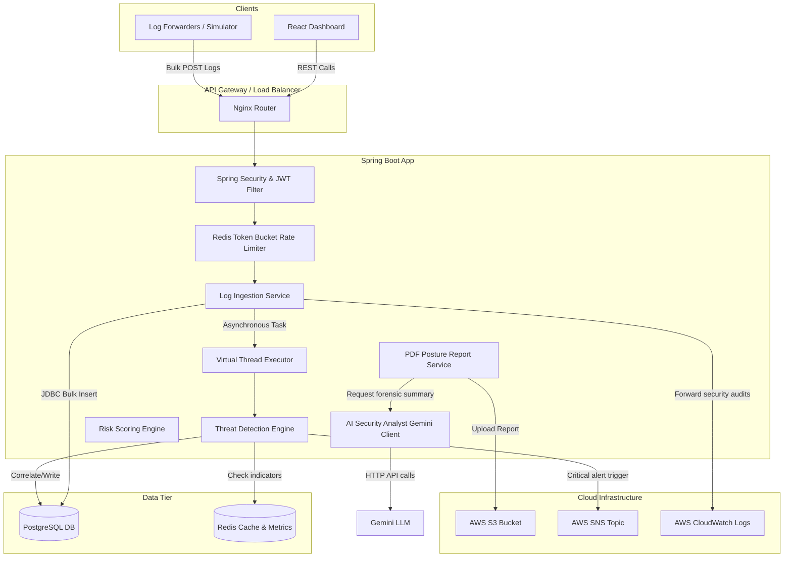
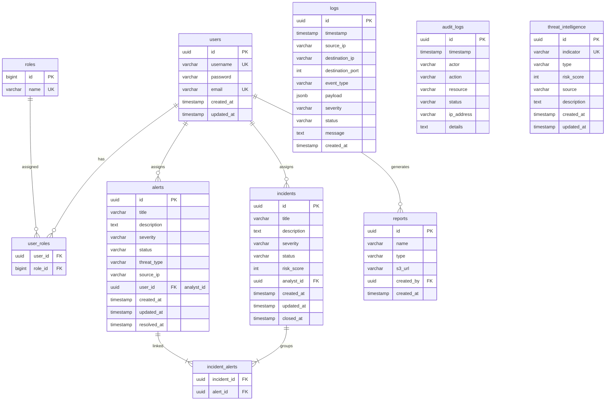

# System Architecture & Design Document

This document describes the design patterns, entity relationships, scalability strategies, and engineering decisions behind the Cloud-Native SIEM and AI Analyst platform.

---

## 1. System Architecture Diagram

---

## 2. Entity Relationship (ER) Diagram

---

## 3. Core Design Decisions

1. **Lombok Removal for Compiler Portability:**
   * **Decision:** We removed Lombok from our JPA models and DTOs, implementing standard getters, setters, constructors, and builder classes manually.
   * **Why:** Newer JDK compiler releases (like JDK 25 running on our environment) often crash when compiling Lombok code due to structural changes in internal compiler packages (`com.sun.tools.javac`). Bypassing Lombok guarantees compilation capability on any JDK release.
2. **Project Loom (Virtual Threads) for Concurrency:**
   * **Decision:** Configured Tomcat to execute on Virtual Threads (`spring.threads.virtual.enabled=true`).
   * **Why:** In standard Web MVC, each request locks a physical OS platform thread. Under high log ingestion volume, thread pools exhaust quickly, causing request timeouts. Virtual threads allow the system to handle thousands of concurrent ingestion requests with near-zero memory footprint and context-switching overhead.
3. **JDBC Template Batching over Hibernate:**
   * **Decision:** Bypassed standard JPA save in loops, opting for `JdbcTemplate.batchUpdate` during bulk log uploads.
   * **Why:** Hibernate triggers single row inserts, dirty checks, and sync operations that severely degrade write throughput. Direct JDBC batching reduces round-trips to the DB, increasing ingestion performance by up to 10x.

---

## 4. Scalability Considerations

* **Partitioning & Log Rotation (Production Recommendations):**
  * PostgreSQL `logs` table will grow rapidly. In production, implement table partitioning by month/week based on the `timestamp` column. This keeps index sizes small and makes log data retention cleanup (e.g. dropping partitions older than 90 days) a zero-downtime operation instead of a heavy DELETE query.
* **Distributed Rate Limiting:**
  * To protect authentication routes, we implemented token-bucket rate limits using Redis. Redis operates at sub-millisecond speeds, preventing malicious scripts from executing DDoS or brute force login loops, without degrading the application performance.
* **Threat Feed Caching:**
  * Malicious indicators of compromise (IPs, hashes) are cached in Redis. During log ingestion, the correlation engine checks the source IP against the Redis cache. Database lookups are only triggered as a fallback, keeping ingestion latency minimal.

---

## 5. System Design Interview Questions & Answers

### Q1: How do you handle high-throughput log ingestion in a SIEM without crashing the application?
**Answer:** High-throughput ingestion is handled through three primary mechanisms:
1. **Asynchronous Handover:** The REST endpoint validates the payload and immediately writes it to a buffer or processes it asynchronously, returning an instant `200 OK` to the log forwarder. In our implementation, we hand logs to a Java 21 virtual thread pool.
2. **Batching:** Database writes are batched (using JDBC templates) rather than executing individual insert queries.
3. **Queueing (Production):** In enterprise environments, we decouple the ingestion API from the parser by placing a message queue (such as Apache Kafka or AWS Kinesis) in between. Ingestion endpoints simply write raw bytes to the queue, and background workers consume and process them at a controlled pace.

### Q2: Why choose PostgreSQL for logs instead of Elasticsearch (NoSQL)?
**Answer:**
* **ACID Compliant Audit Trail:** Alerts, incidents, and audit logs require strong relational integrity, relational schemas, foreign key mappings, and transactional boundaries.
* **Hybrid JSONB:** PostgreSQL offers `JSONB` columns, combining relational database compliance with schema-less JSON storage. Analysts can search inside unstructured payloads using GIN indexes.
* **Cost & Management:** For low-to-medium deployments, maintaining a single robust database engine (PostgreSQL) is significantly cheaper and easier than managing an Elasticsearch cluster alongside a relational DB. For ultra-scale log storage, ELK or OpenSearch remain the choice.

### Q3: How does the threat engine detect brute force attempts across distributed instances?
**Answer:**
* We track failed authentication attempts in a centralized cache (such as Redis) using a sliding window.
* When a failed login occurs, the username and source IP are logged. A Redis transaction increments a key (e.g. `brute_force:192.168.1.52` or `brute_force:admin`) with an expiration TTL matching the window (e.g. 5 minutes).
* If the value exceeds the threshold (e.g. 5 failures), a threat engine trigger is fired, generating an Alert. Using Redis ensures that even if login requests are balanced across 10 distinct application servers, the overall failed login attempts are coordinated globally in real-time.
